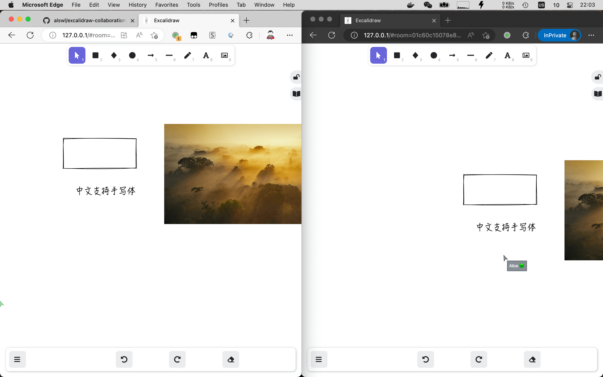

# excalidraw-collaboration

One click to init an excalidraw with collaboration.

Snapshot:



Demo:

[Live Demo](https://draw2.dmitrysamoylenko.in/)
A live room sample here: [live room](https://draw2.dmitrysamoylenko.in/#room=f8671f3fdef3ada5128c,Dyn8aqg8RII9rzUVIl9i7w)

Thanks a lot to @samoylenkodmitry.

Related docs:

- [Self hosted online collaborative drawing platform Excalidraw | Log4D](https://en.blog.alswl.com/2022/10/self-hosted-excalidraw/)
- [私有化在线协同画图平台 Excalidraw | Log4D]( https://blog.alswl.com/2022/10/self-hosted-excalidraw/ )


## Build and Run

Clone, patch, and build:

```
git clone --recursive git@github.com:alswl/excalidraw-collaboration.git
cd excalidraw-collaboration
git config submodule.excalidraw.ignore all # ignore submodule changes, we will patch them

# $EDITOR excalidraw.env.production  # (optional) edit service endpoint

make patch images # patch to configurations and build the container image
make update-docker-compose-version # update images version for docker-compose
docker-compose up # run the containers

open "http://localhost" # open browser, and you can using the Team work functions
```

Bump version:

```
# make sure all changes are commited
make images # build new image without dirty

make bump-version # bump version if your configuration changes(the changes will build into 
git commit -a -m 'feat: bump with my local config' # save your changes
```

Browse it:

- open http://127.0.0.1/ ,and you will see the excalidraw page
- Click the `Live Collaboration` button, and you will see the collaboration page
- Now you can share the collaboration page with your friends, and you can draw together.


About public network release:

if you want to release your own excalidraw in public network,
you should modify the `excalidraw.env.production` file,
Replace the `REACT_APP_HTTP_STORAGE_BACKEND_URL` and `REACT_APP_WS_SERVER_URL` with your own domain.
