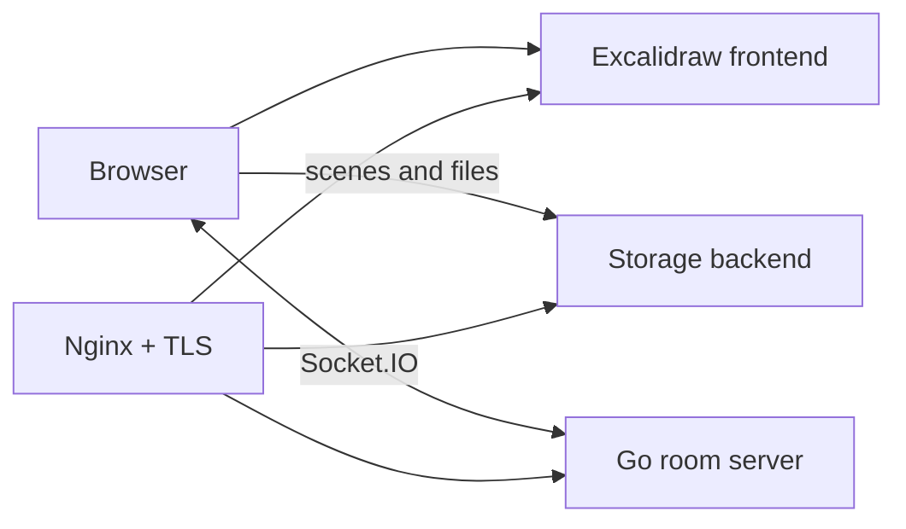

# Excalidraw Collaboration

Self-hosted Excalidraw with live collaboration, scene storage, and a small set
of Docker Compose deployment examples.

## Status

- The [Railway demo](https://excalidraw-production-1dbf.up.railway.app) is live
  and has been verified with `alswl/excalidraw-room-go:v0.1.0`.
- The collaboration service is the Go implementation in
  [excalidraw-room-go](https://github.com/alswl/excalidraw-room-go).
- The former Zeabur demo has been retired.

## What is included

- An Excalidraw frontend configured through runtime environment variables.
- HTTP storage for scenes and files.
- A Socket.IO room service for real-time collaboration.
- A local Compose example and an HTTPS/Nginx production example.


```mermaid
flowchart LR
  Browser[Browser] --> Frontend[Excalidraw frontend]
  Browser -->|scenes and files| Storage[Storage backend]
  Browser <-->|Socket.IO| Room[Go room server]
  Nginx[Nginx + TLS] --> Frontend
  Nginx --> Storage
  Nginx --> Room
```

The exact service wiring is defined in [basic/docker-compose.yaml](basic/docker-compose.yaml)
and [advanced-nginx/compose.yml](advanced-nginx/compose.yml).

## Quick start

Prerequisite: Docker Compose.

```sh
git clone https://github.com/alswl/excalidraw-collaboration.git
cd excalidraw-collaboration
docker-compose -f basic/docker-compose.yaml up -d
```

Open <http://127.0.0.1/>, select **Live Collaboration**, then share the room
link with another browser session.

| Service | Local address |
| --- | --- |
| Excalidraw | <http://127.0.0.1/> |
| Storage backend | <http://127.0.0.1:8081> |
| Room server | <http://127.0.0.1:8082> |

To stop the stack:

```sh
docker-compose -f basic/docker-compose.yaml down
```

## Deploy

### Local development

Use [basic/docker-compose.yaml](basic/docker-compose.yaml). It exposes the
frontend, storage backend, and room service on separate local ports.

### One-domain HTTPS deployment

Use [advanced-nginx/compose.yml](advanced-nginx/compose.yml) together with
[draw.example.com.conf](advanced-nginx/draw.example.com.conf). Copy
[.env-example](advanced-nginx/.env-example) to `.env`, set the host names and
database credentials, then configure the supplied Nginx virtual host.

The Nginx configuration forwards `/` to the frontend, `/storage/` to storage,
and `/socket.io/` to the room service with WebSocket upgrade headers. HTTPS is
required for browser crypto APIs used by collaboration.

### Public endpoints

For a public deployment, configure these frontend variables with your public
URLs:

- `VITE_APP_HTTP_STORAGE_BACKEND_URL`
- `VITE_APP_WS_SERVER_URL`

The values used by each example are visible in its Compose file. Keep the
room image pinned to a released version; the current examples use
`alswl/excalidraw-room-go:v0.1.0`.

## Related projects

- [excalidraw-room-go](https://github.com/alswl/excalidraw-room-go) — Go
  implementation of the Excalidraw Socket.IO room server.
- [excalidraw-storage-backend](https://github.com/alswl/excalidraw-storage-backend)
  — storage backend used by this stack.
- [excalidraw](https://github.com/alswl/excalidraw) — self-hosting-focused
  Excalidraw fork used for the frontend image.
- [excalidraw.alswl.com](https://github.com/alswl/excalidraw.alswl.com) —
  static Excalidraw site with Chinese font support.
- [excalidraw-room-railway](https://github.com/alswl/excalidraw-room-railway)
  and [excalidraw-storage-backend-railway](https://github.com/alswl/excalidraw-storage-backend-railway)
  — Railway deployment repositories.

## Community and support

Questions, bug reports, and deployment experiences are welcome in
[GitHub Issues](https://github.com/alswl/excalidraw-collaboration/issues).
For a code change, please open a pull request with a short description and
the validation you ran.

## Further reading

- [Self hosted online collaborative drawing platform Excalidraw | Log4D](https://en.blog.alswl.com/2022/10/self-hosted-excalidraw/)
- [私有化在线协同画图平台 Excalidraw | Log4D](https://blog.alswl.com/2022/10/self-hosted-excalidraw/)

## License

[MIT](LICENSE)

## Contributors

<a href="https://github.com/alswl/excalidraw-collaboration/graphs/contributors">
  
</a>
